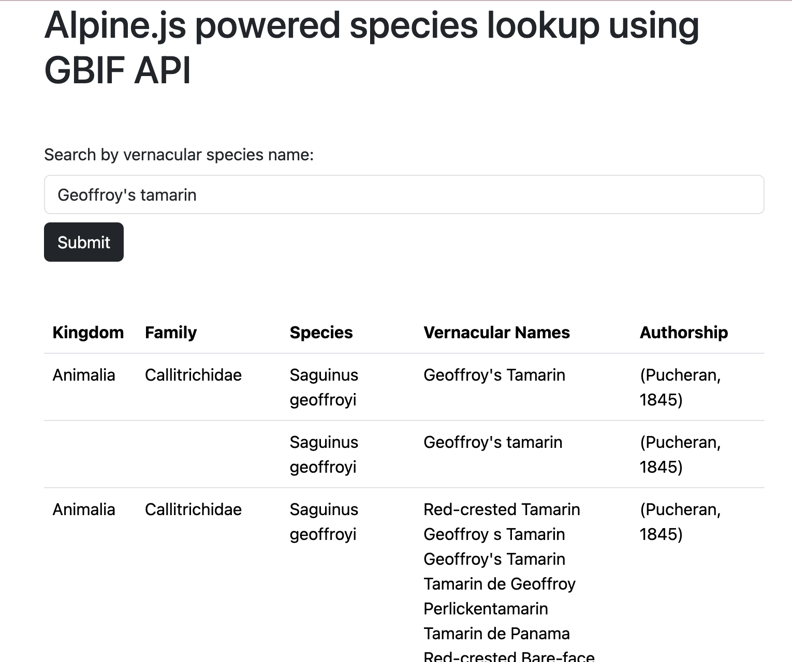

# Alpine.js api call triggerd by form submit
Example of using Alpine.js to call a public API using a search term entered by the user.
The response data is displayed dynamically in a table.

# Screenshot

# References

1. [Alpine.js Official Docs -Getting Started](https://alpinejs.dev/start-here)
2. [Calling an API with Alpine.js](https://dev.to/michaelburrows/alpinejs-displaying-api-data-in-a-html-table-4ki1)
3. [Building an AJAX form with Alpine.js](https://technotrampoline.com/articles/building-an-ajax-form-with-alpinejs/)
